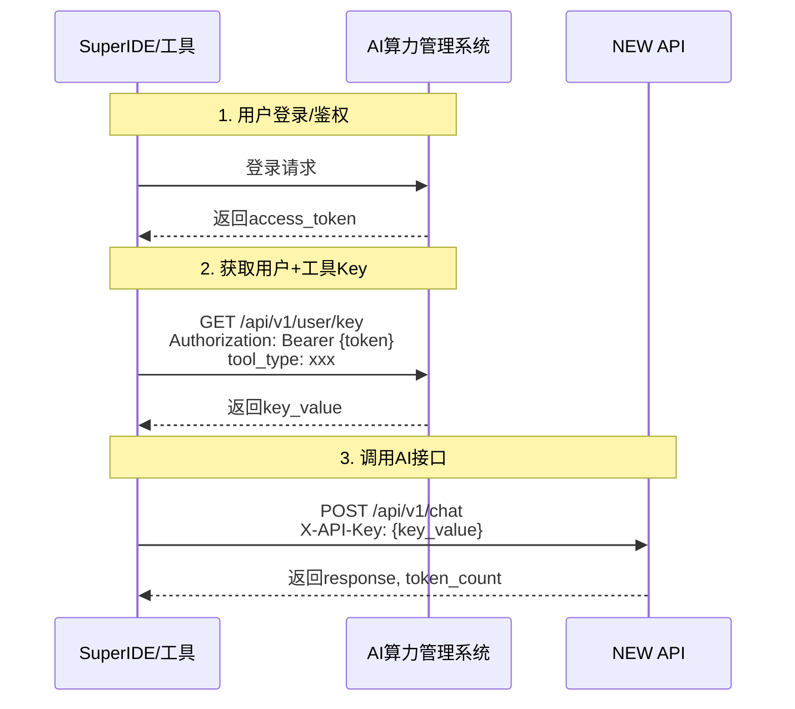

# 方案C时序图 - Token按项目比例结算



## 流程说明

1. **用户登录**：SuperIDE用户向AI算力管理系统登录鉴权，获取用户Token
2. **返回鉴权Token**：AI算力管理系统返回access_token
3. **获取Key**：SuperIDE携带鉴权Token和工具类型，请求获取用户+工具的唯一Key
4. **返回Key**：AI算力管理系统返回key_value
5. **调用AI**：SuperIDE携带Key调用NEW API
6. **返回结果**：NEW API返回AI结果和Token使用量

## 接口说明

### API 1: 登录鉴权
```
POST /api/v1/auth/login
→ 返回 {access_token}
```

### API 2: 获取用户Key
```
GET /api/v1/user/key?tool_type={tool_type}
请求头：Authorization: Bearer {access_token}
返回：{key_value: "xxx"}
```

### API 3: 调用AI
```
POST /api/v1/chat
请求头：X-API-Key: {key_value}
```
